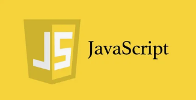
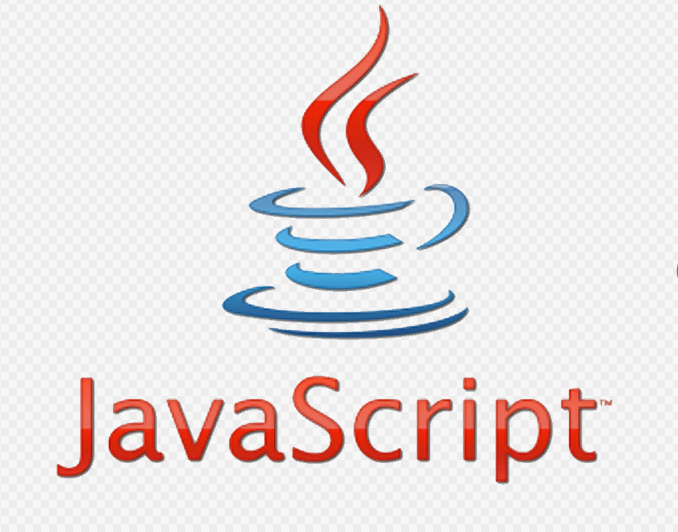

Цикл  for - это оператор потока управления, который вы можете использовать для перебора последовательности (например, строки, списка, кортежа, словаря, набора, string). Оператор for выполняет определенный блок кода для каждого элемента в последовательности. Отличной особенностью циклов for в  является то, что один и тот же код может работать без изменений с несколькими типами данных.

## JavaScript

Язык программирования
Мультипарадигменный язык программирования, который поддерживает объектно-ориентированный, императивный и функциональный стили.
Это реализация спецификации ECMAScript (стандарт ECMA-262). JavaScript обычно используется как встраиваемый язык для… Читать ещё
Мультипарадигменный язык программирования, который поддерживает объектно-ориентированный, императивный и функциональный стили.
Это реализация спецификации ECMAScript (стандарт ECMA-262). JavaScript обычно используется как встраиваемый язык для программного доступа к объектам приложений. Наиболее широкое применение находит в браузерах как язык сценариев для придания интерактивности веб-страницам. Скрыть
Википедия
Год выхода: 1995 год
- in first its name is "Mocha"
VERY POPULAR LANGUAGE IN WORLD FOR WEB-PROGRAMS

> This language was created by Brenden Eich   
JavaScript is a scripting or programming language that allows you to implement complex features on webpages                         And we can see result its code with 3 wey 1.in console web brouser 2.Using termal node js. 3.and or CODE RUNNER(very very very easy way)
we can connect JS in HTML with elementi-script> and atribut src>

we can create veriable in JS with 3 ways  >
 1. war- old wersion 
 2. 2.let new wey of diclaretion string in ES6(es2015) version and 
 3. 3.const value in Js is 2: 1.Object 2.Primitive
we can show our work with 2 ways :console.log and 2 .decument wrote !!WE READ IT IN DOM!!
and operators in JAVAScript
One of the important thing in JS is function
Function-is a block of code it work when we called it function ba 3 namud judo meshavad 1.funcsiyai nomdor-declaretion

2.function expresion:da drunsh 2 funcsiyai diga dora 1Arrow function 2.Anonymous function

3.funcsiyai-Immediately Invoked Function Expression (IIFE)
